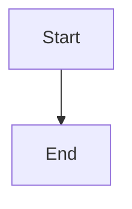

# Markdown Syntax

Pourdown is a full Markdown editor, not just an import tool. This page lists
every Markdown syntax feature the editor actually renders and round-trips
today, grouped the way you'd expect from a Markdown reference. Each entry
shows the raw syntax and what it produces.

## Headings

```md
# Heading 1
## Heading 2
### Heading 3
#### Heading 4
##### Heading 5
###### Heading 6
```

All six levels are supported.

## Emphasis

```md
**bold** or __bold__
*italic* or _italic_
~~strikethrough~~
`inline code`
==highlight==
~subscript~
^superscript^
```

`<mark>`, `<sub>`, and `<sup>` HTML tags also work as input and are normalized
to the `==`/`~`/`^` shorthand above when the document is saved.

## Line breaks

A single newline within a paragraph renders as a visible line break (Typora/GFM
style) — you don't need a trailing double-space or a blank line to break a line.

## Blockquotes

```md
> A quoted line.
> Another line in the same quote.
```

## Lists

```md
- Bullet item
- Another item
  - Nested item

1. Ordered item
2. Another ordered item

- [ ] An unchecked task
- [x] A checked task
  - [ ] A nested task
```

Bullet lists (`-`, `*`, `+`), ordered lists, and nested/checkable task lists are
all supported.

## Horizontal rule

```md
---
```

## Code blocks

````md
```js
function hello() {
  console.log("hello");
}
```
````

Fenced code blocks render with syntax highlighting for ~30 languages (JS/TS,
Python, Rust, Go, C/C++, C#, Kotlin, shell, YAML, and more), including common
aliases (`js`, `py`, `rb`, `sh`, `rs`, `yml`, …).

### Mermaid diagrams

````md

````

A fenced block with language `mermaid` (or `mmd`) renders as a live diagram
instead of highlighted text.

## Math

```md
Inline math: $e^{i\pi} + 1 = 0$

Block math:

$$
\begin{bmatrix} 1 & 0 \\ 0 & 1 \end{bmatrix}
$$
```

Both inline (`$...$`) and block (`$$...$$`) math render live via KaTeX. A
fenced ```` ```math ````, ```` ```latex ````, or ```` ```tex ```` code block also
renders as display math. Ordinary currency like `$5 and $10` is left alone —
it isn't mistaken for math.

## Tables

```md
| Name  | Role    |
| :---- | :-----: |
| Ada   | Engineer |
| Grace | Admiral  |
```

GFM pipe tables are supported, including left/center/right column alignment.

## Links and images

```md
[Pourdown](https://github.com/passpier/Pourdown "tooltip")


```

Bare URLs (e.g. `https://example.com` typed directly in text) are also
auto-linked as you type.

## Definition lists

```md
Term
: Definition text.

Second term
: First definition.
: Second definition.
```

A blank line is required between separate terms — without one, the second
term is read as a continuation of the first definition (standard Markdown
paragraph rules), not a new term. A literal `<dl>`/`<dt>`/`<dd>` HTML block
also still works, as raw HTML.

## Footnotes

```md
Here's a claim that needs a source.[^1]

[^1]: This is the footnote text.
```

Footnote references and definitions are supported, with click-to-jump
navigation between the two.

## YAML front matter

```md
---
title: My Document
tags: [notes, draft]
---
```

Front matter at the top of a document is preserved and editable as a
`yaml` code block.

## Inline HTML

```md
Press <kbd>Cmd</kbd> + <kbd>S</kbd> to save.

<mark>Highlighted text</mark>

H<sub>2</sub>O and E = mc<sup>2</sup>

<u>Underlined text</u>

<abbr title="World Health Organization">WHO</abbr>

<small>Fine print</small>
```

Pourdown recognizes `<kbd>`, `<mark>` (highlight), `<sub>`, `<sup>`, `<u>` /
`<ins>` (underline), `<abbr title="...">`, and `<small>` as inline formatting.
Other block-level HTML (e.g. `<div>`, `<details>`) passes through as raw HTML.

## Smart typography

As you type, `--` becomes an en dash, `...` becomes an ellipsis (`…`), `(c)`
becomes `©`, and similar common substitutions are applied automatically.

## Emoji

```md
Have a nice day :smile:!
```

Shortcodes are converted to the Unicode emoji character (😄) as you type or
on import. This is one-way: the document is saved with the emoji character
itself, not the `:smile:` shortcode.

## Not yet supported

This is common in other Markdown editors but isn't implemented in Pourdown
yet — tracked here as a future plan rather than documented as working:

- Syntax highlighting in Source mode (Source mode is currently plain text)
