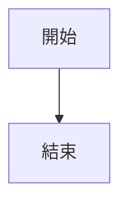

# Markdown 語法

Pourdown 不只是匯入工具，也是一個完整的 Markdown 編輯器。本頁列出編輯器
目前實際會渲染並可正確保留（round-trip）的所有 Markdown 語法，依照一般
Markdown 參考文件的分類方式呈現。每個項目都附上原始語法，以及它會產生
的效果。

## 標題

```md
# 標題 1
## 標題 2
### 標題 3
#### 標題 4
##### 標題 5
###### 標題 6
```

支援全部六個層級。

## 強調

```md
**粗體** 或 __粗體__
*斜體* 或 _斜體_
~~刪除線~~
`行內程式碼`
```

## 換行

段落內的單一換行會直接顯示為換行（Typora／GFM 風格）——不需要在行尾加
兩個空格或空一行才能換行。

## 引言區塊

```md
> 一段引言。
> 同一段引言的另一行。
```

## 清單

```md
- 項目符號
- 另一個項目
  - 巢狀項目

1. 有序清單項目
2. 另一個有序項目

- [ ] 未勾選的待辦事項
- [x] 已勾選的待辦事項
  - [ ] 巢狀待辦事項
```

項目符號清單（`-`、`*`、`+`）、有序清單，以及巢狀／可勾選的待辦清單皆支援。

## 水平分隔線

```md
---
```

## 程式碼區塊

````md
```js
function hello() {
  console.log("hello");
}
```
````

程式碼區塊支援約 30 種語言的語法高亮（JS/TS、Python、Rust、Go、C/C++、C#、
Kotlin、shell、YAML 等），並支援常見別名（`js`、`py`、`rb`、`sh`、`rs`、`yml` 等）。

### Mermaid 圖表

````md

````

語言標記為 `mermaid`（或 `mmd`）的區塊會渲染成即時圖表，而非高亮文字。

## 數學公式

```md
行內數學：$e^{i\pi} + 1 = 0$

區塊數學：

$$
\begin{bmatrix} 1 & 0 \\ 0 & 1 \end{bmatrix}
$$
```

行內（`$...$`）與區塊（`$$...$$`）數學公式皆透過 KaTeX 即時渲染。標記為
```` ```math ````、```` ```latex ```` 或 ```` ```tex ```` 的程式碼區塊也會渲染
為展示用數學公式。一般貨幣寫法（例如 `$5 and $10`）不會被誤判為數學公式。

## 表格

```md
| 姓名  | 職位     |
| :---- | :------: |
| Ada   | 工程師   |
| Grace | 上將     |
```

支援 GFM 表格語法，包含靠左／置中／靠右的欄位對齊。

## 連結與圖片

```md
[Pourdown](https://github.com/passpier/Pourdown "提示文字")


```

直接輸入的網址（例如 `https://example.com`）也會在輸入時自動變成連結。

## 註腳

```md
這是一個需要來源的說法。[^1]

[^1]: 這裡是註腳內容。
```

支援註腳的引用與定義，並可在兩者之間點擊跳轉。

## YAML 前置資料（Front Matter）

```md
---
title: 我的文件
tags: [notes, draft]
---
```

文件開頭的前置資料會被保留，並以 `yaml` 程式碼區塊的形式可編輯。

## 行內 HTML

```md
按下 <kbd>Cmd</kbd> + <kbd>S</kbd> 即可儲存。

<mark>螢光標記文字</mark>

H<sub>2</sub>O 與 E = mc<sup>2</sup>

<u>底線文字</u>

<abbr title="World Health Organization">WHO</abbr>

<small>小字說明</small>
```

Pourdown 能辨識 `<kbd>`、`<mark>`（螢光標記）、`<sub>`、`<sup>`、`<u>` /
`<ins>`（底線）、`<abbr title="...">` 以及 `<small>` 作為行內格式。其他
區塊層級的 HTML（例如 `<div>`、`<details>`）則會以原始 HTML 形式保留。

## 智慧排版

輸入時，`--` 會自動變成 en dash、`...` 會變成省略號（`…`）、`(c)` 會變成
`©`，以及其他類似的常見自動代換。

## 尚未支援

以下是其他 Markdown 編輯器常見、但 Pourdown 目前尚未實作的功能——列在這裡
作為未來規劃，而非已支援的功能：

- `==highlight==` 簡寫語法（目前僅支援 `<mark>` HTML 標籤）
- `~sub~` / `^sup^` 簡寫語法（目前僅支援 `<sub>`／`<sup>` HTML 標籤）
- 定義清單（`詞彙` / `: 定義`）
- Emoji 短代碼（`:smile:`）
- 原始碼模式的語法高亮（原始碼模式目前為純文字）
